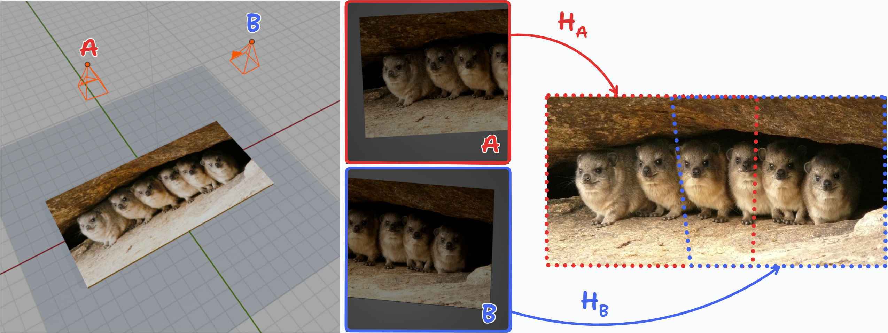

### Question:

The application scenario here is when you photograph a flat object twice to capture two partial images of it, then stitch the two planar sections from the photos into a complete plane. 
We have provided a working Python script — in this discussion thread, try feeding the script with real-world photographs (e.g., images of billboards, signboards, or other large flat surfaces) and explore the limitations of this approach and potential areas for improvement.

